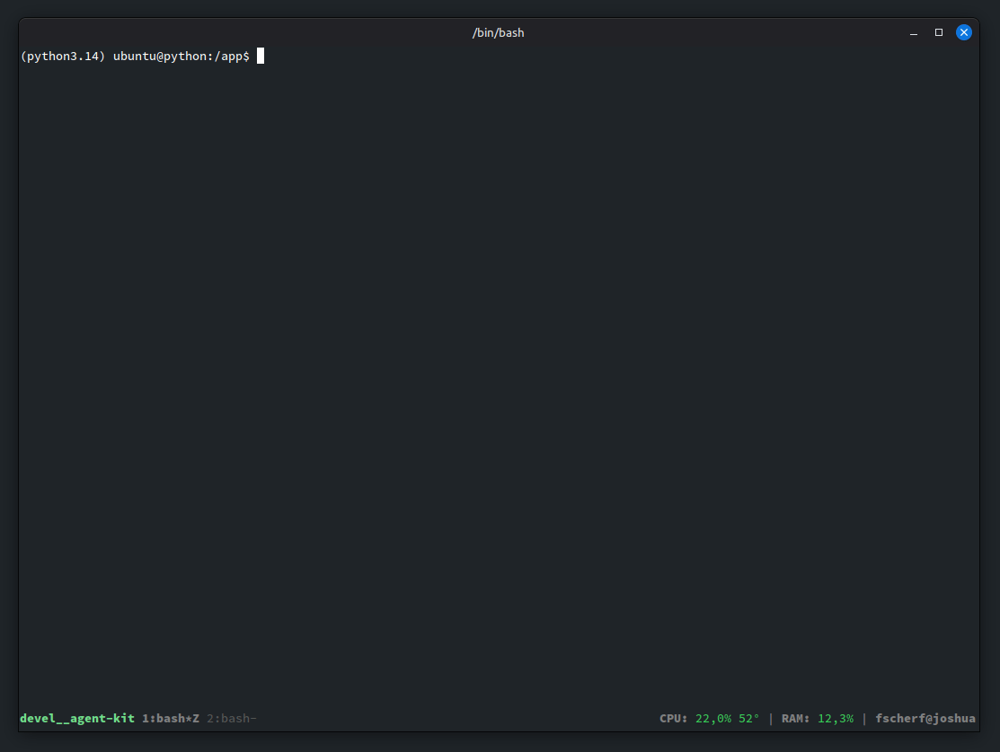

# agent-kit

agent-kit is a collection of simple tools to make local and remote LLM and
MCP development easier.

## Demo



**Simple Example MCP Tool:**
```python
import datetime

from agent_kit.decorators import mcp_tool


@mcp_tool(confirm=True)
def get_current_time():
    """
    Returns the current time as an ISO string.
    """

    return str(datetime.datetime.now().isoformat())
```
